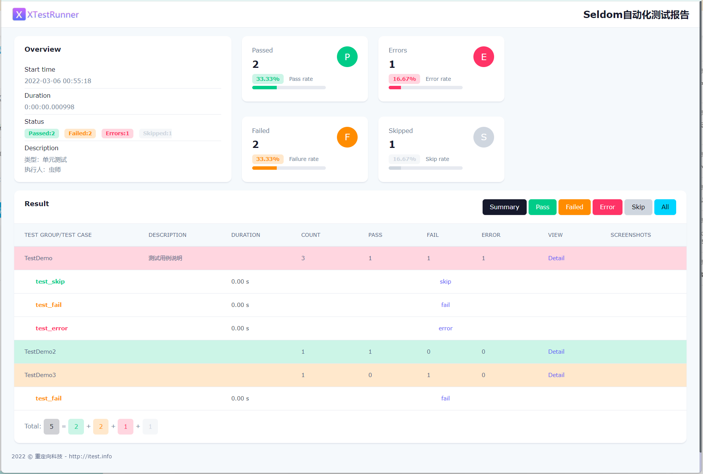
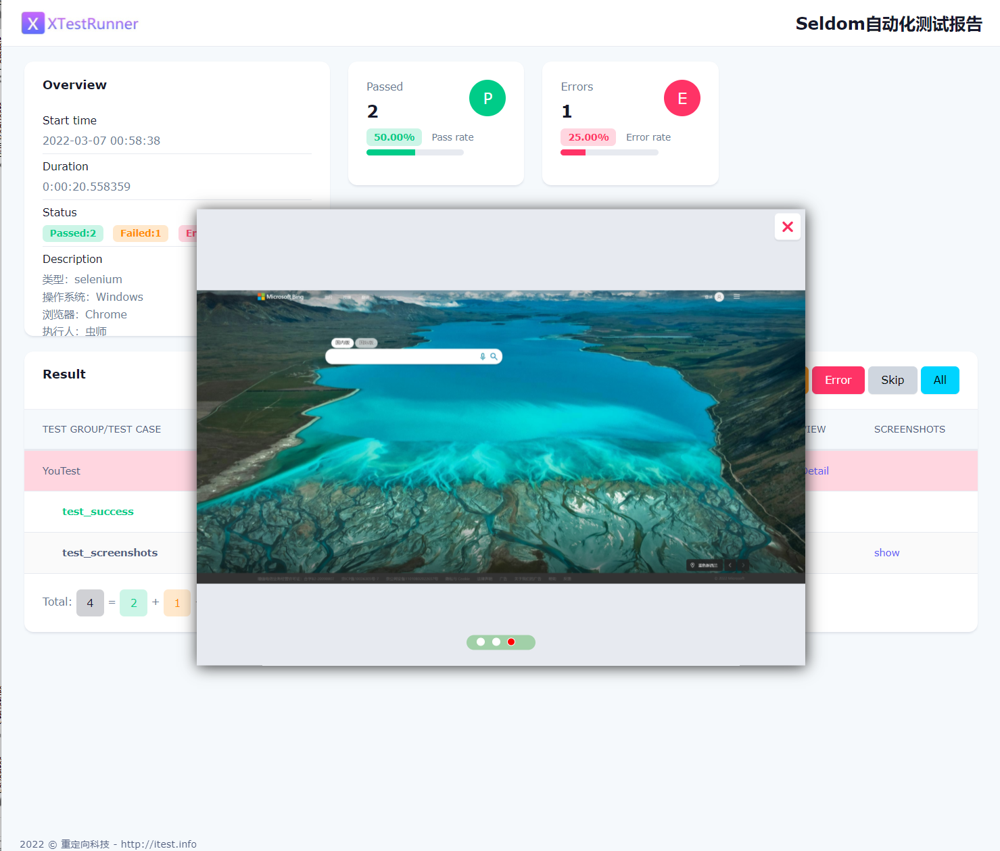
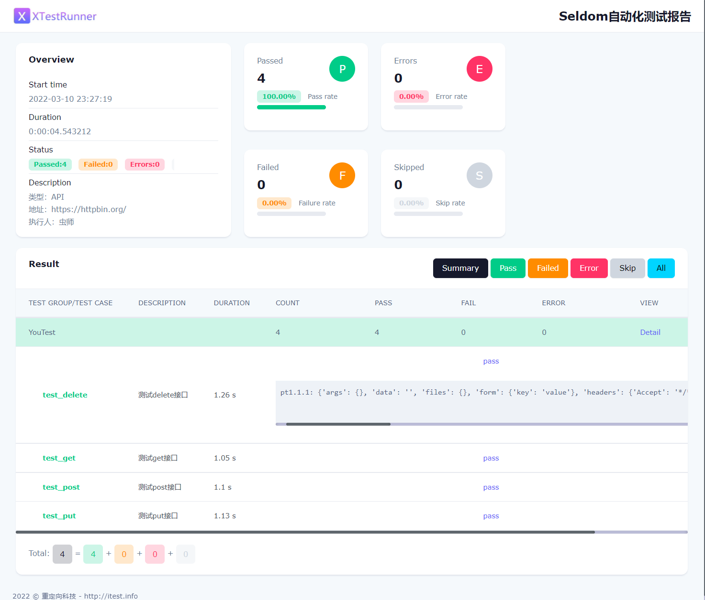
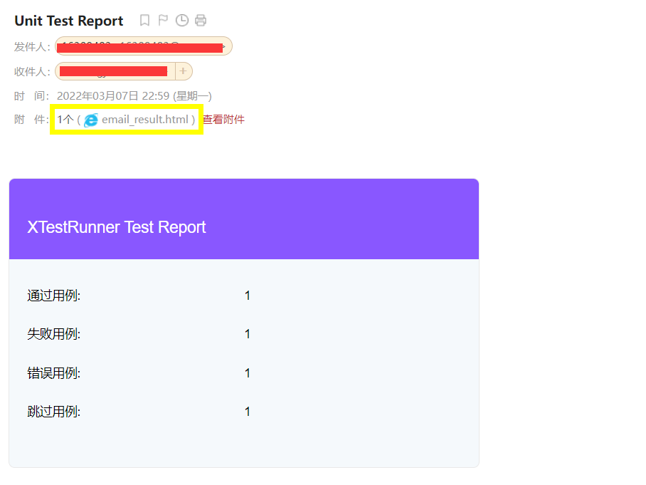
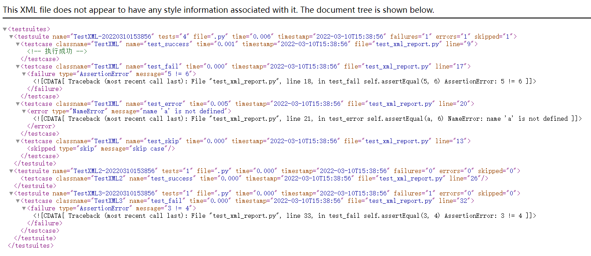

# XTestRunner 文档 [中文版]

unittest单元测试框架：
https://docs.python.org/3/library/unittest.html

## 安装

* pip安装

```shell
> pip install XTestRunner
```

## 例子

* [单元测试](../test/test_unit.py)

* [Selenium自动化测试](../test/test_selenium.py)

* [requests接口测试](../test/test_api.py)

* [发送邮件](../test/test_send_email.py)

* [黑白名单](../test/test_label.py)

* [XML格式的报告](../test/test_xml_report.py)


## 使用文档


### 单元测试 

XTestRunner基本用法，用于生成 HTML测试报告。

__测试用例__

```python
# test_unit.py
import unittest
from XTestRunner import HTMLTestRunner


class TestDemo(unittest.TestCase):
    """测试用例说明"""
    
    def test_success(self):
        """执行成功"""
        self.assertEqual(2 + 3, 5)
    
    @unittest.skip("skip case")
    def test_skip(self):
        """跳过用例"""
        pass
    
    def test_fail(self):
        """失败用例"""
        self.assertEqual(5, 6)
    
    def test_error(self):
        """错误用例"""
        self.assertEqual(a, 6)

if __name__ == '__main__':
    suit = unittest.TestSuite()
    suit.addTests([
        TestDemo("test_success"),
        TestDemo("test_skip"),
        TestDemo("test_fail"),
        TestDemo("test_error")
    ])
    
    with(open('./result.html', 'wb')) as fp:
        runner = HTMLTestRunner(
            stream=fp,
            title='<project name>test report',
            description='describe: ... ',
            language='en',
        )
        runner.run(
            testlist=suit,
            rerun=2,
            save_last_run=False
        )
```

__`HTMLTestRunner`类说明__

* `stream`: 指定报告的路径。
* `title`: 报告的标题。
* `description`: 报告的描述, 支持`str`、`list`两种类型。
* `language`: 支持中文`zh-CN`, 默认`en`。

__`run()`方法说明__

* `testlist`: 运行的测试套件。
* `rerun`: 重跑次数。
* `save_last_run`: 是否保存最后一个重跑结果。


__运行测试__

```shell
> python test_unit.py
```

__测试报告__



### Selenium Web测试

针对Selenium Web自动化测试提供了`失败/错误` 自动截图功能。

__注意__

1.安装selenium
```shell
> pip install selenium
```

2.注意：驱动必须定义为 `driver`， 否则无法生成截图。

__测试用例__

```python
import unittest
from XTestRunner import HTMLTestRunner
from selenium import webdriver
from selenium.webdriver.common.by import By


class SeTest(unittest.TestCase):

    @classmethod
    def setUpClass(cls) -> None:
        cls.driver = webdriver.Chrome()
        cls.base_url = "https://cn.bing.com/"

    @classmethod
    def tearDownClass(cls) -> None:
        cls.driver.quit()

    def test_success(self):
        """测试bing搜索：XTestRunner """
        self.driver.get(self.base_url)
        search = self.driver.find_element(By.ID, "sb_form_q")
        search.send_keys("XTestRunner")
        search.submit()

    def test_error(self):
        """测试bing搜索，定位失败 """
        self.driver.get(self.base_url)
        self.driver.find_element(By.ID, "sb_form_qxxx").send_keys("python")

    def test_fail(self):
        """测试bing搜索，断言失败 """
        self.driver.get(self.base_url)
        self.driver.find_element(By.ID, "sb_form_q").send_keys("unittest")
        self.assertEqual(self.driver.title, "unittest")

    def test_screenshots(self):
        """测试截图"""
        self.driver.get(self.base_url)
        # 元素截图
        elem = self.driver.find_element(By.ID, "sb_form_q")
        self.images.append(elem.screenshot_as_base64)
        # 竖屏截图
        self.images.append(self.driver.get_screenshot_as_base64())
        # 最大化截图
        self.driver.maximize_window()
        self.images.append(self.driver.get_screenshot_as_base64())


if __name__ == '__main__':
    report = "./selenium_result.html"
    with(open(report, 'wb')) as fp:
         unittest.main(testRunner=HTMLTestRunner(
            stream=fp,
            title='Selenium自动化测试报告',
            description=['类型：selenium', '操作系统：Windows', '浏览器：Chrome', '执行人：虫师']
        ))
```

__测试报告__

一个用例支持多张截图，不同的截图自动轮播，而且优化之后，不管是页面元素截图，横向、纵向图片都可以很好的展示。




## API 接口测试

XTestRunner 当然也支持HTTP接口测试了。

* 安装requests

```shell
> pip install requests
```

__测试用例__

```python
import requests
import unittest
from XTestRunner import HTMLTestRunner

class YouTest(unittest.TestCase):

    def test_get(self):
        """测试get接口 """
        r = requests.get("https://httpbin.org/get", params={"key":"value"})
        print(r.json())

    def test_post(self):
        """测试post接口 """
        r = requests.post("https://httpbin.org/post", data={"key":"value"})
        print(r.json())

    def test_put(self):
        """测试put接口 """
        r = requests.put("https://httpbin.org/put", data={"key":"value"})
        print(r.json())

    def test_delete(self):
        """测试delete接口 """
        r = requests.delete("https://httpbin.org/delete", data={"key":"value"})
        print(r.json())


if __name__ == '__main__':
    report = "./reports/api_result.html"
    with(open(report, 'wb')) as fp:
        unittest.main(testRunner=HTMLTestRunner(
            stream=fp,
            title='Seldom自动化测试报告',
            description=['类型：API', '地址：https://httpbin.org/', '执行人：虫师']
        ))
```

__测试报告__

通过`print()` 可以讲接口信息打印到报告中展示。




### 邮件功能

XTestRunner 支持邮件功能。

```python
import unittest
from XTestRunner import HTMLTestRunner
from XTestRunner import SMTP
...

if __name__ == '__main__':
    report = "./reports/send_email_result.html"
    with(open(report, 'wb')) as fp:
        unittest.main(testRunner=HTMLTestRunner(
            stream=fp,
            title='测试发送邮件',
            description=['类型：测试发送邮件', '执行人：虫师']
        ))
    # 发邮件功能
    # 使用126邮箱发送时password应为授权码而非用户密码，须在邮箱客户端设置开启授权码
    # 使用gmail邮箱发送时password为用户密码，须在gmail客户端开启安全性较低的应用的访问权限
    smtp = SMTP(user="sender@qq.com", password="xxx", host="smtp.qq.com")
    smtp.sender(to="fnngj@126.com", subject="XTestRunner测试邮件", attachments=report)

```

__邮件展示__




### 支持黑白名单

可以通过黑白名单选择要执行（或跳过）的用例。

* 支持白黑名单
  * 白名单：whitelist=["base"]  只有使用@label("base")装饰的用例执行
  * 黑名单：blacklist=["slow"]  只有使用@label("slow")装饰的用例不被执行

__测试用例__

```python
import unittest
from XTestRunner import label
from XTestRunner import HTMLTestRunner


class LabelTest(unittest.TestCase):

    @label("base")
    def test_label_base(self):
        self.assertEqual(1+1, 2)

    @label("slow")
    def test_label_slow(self):
        self.assertEqual(1, 2)

    def test_no_label(self):
        self.assertEqual(2+3, 5)


if __name__ == '__main__':
    report = './reports/label_result.html'
    with(open(report, 'wb')) as fp:
        unittest.main(testRunner=HTMLTestRunner(
            stream=fp,
            title='<project name>test report',
            description='describe: ... ',
            whitelist=["base"],  # 设置白名单
            # blacklist=["slow"],  # 设置黑名单
        ))
```

__注意：__

白名单和黑名单不要同时用，以免产生冲突。


### XML格式报告

虽然，HTML报告的颜值很高，但有时需要提取测试数据，比如保存到数据库，这个时候从HTML报告中提取数据是非常麻烦的，所以，XTestRunner 支持XML格式的报告。

```python
import unittest
from XTestRunner import XMLTestRunner

#...

if __name__ == '__main__':
    # 定义报告
    report = "./xml_result.xml"
    with(open(report, 'wb')) as fp:
        unittest.main(testRunner=XMLTestRunner(output=fp))
```

__报告展示__




